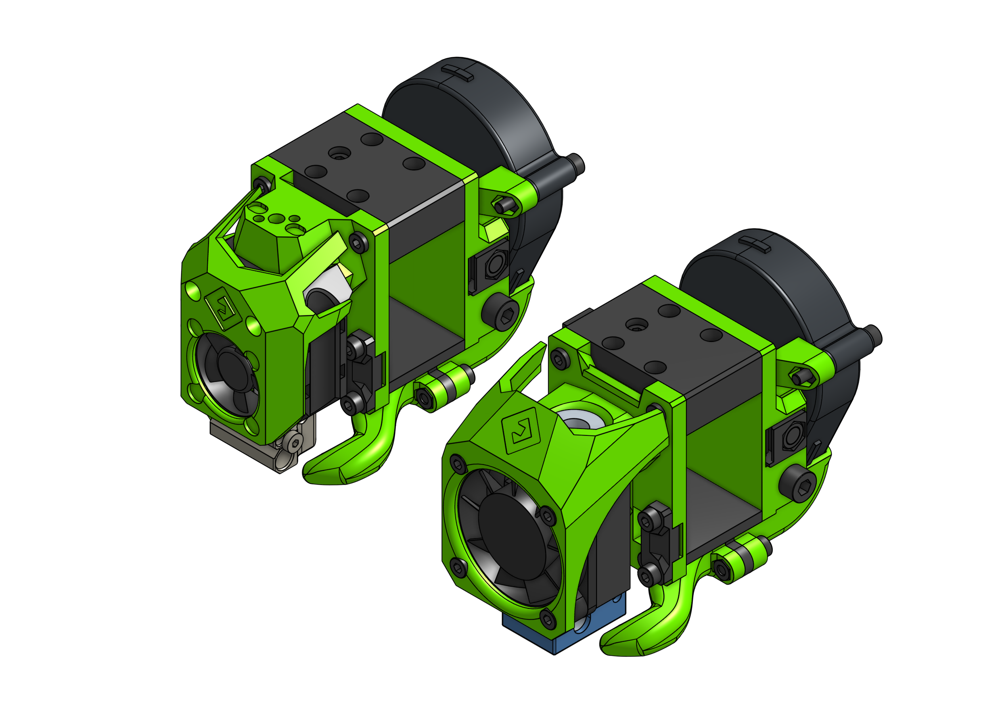
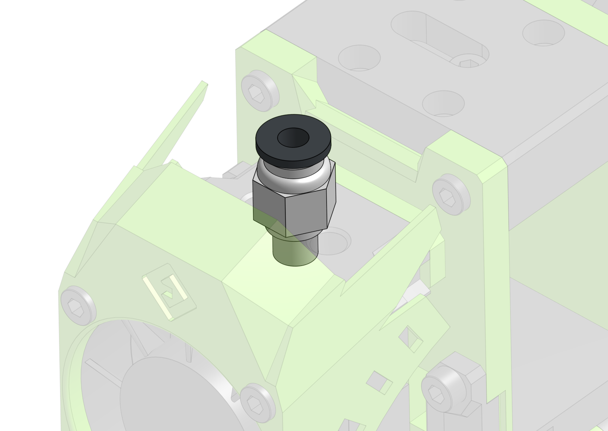
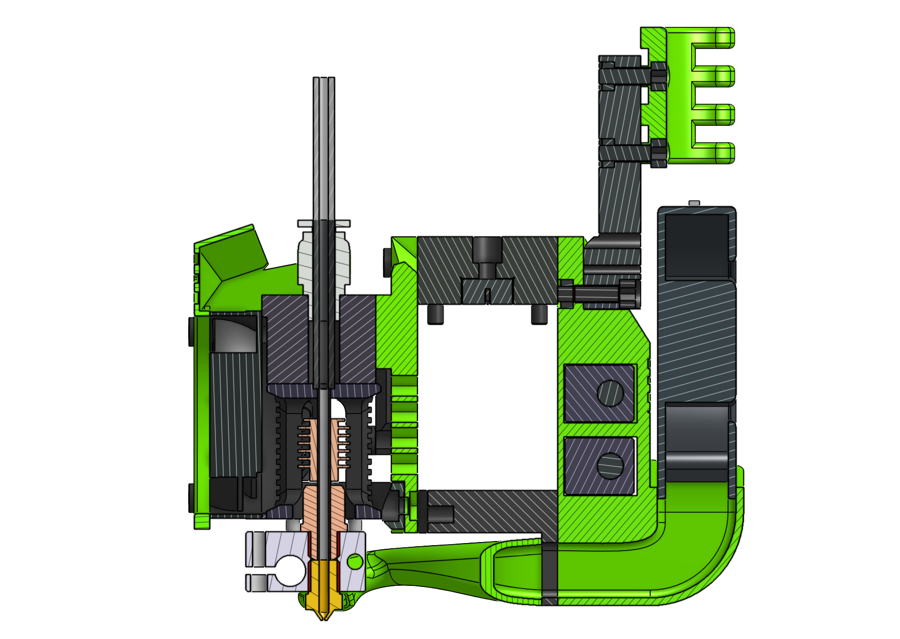

---
badges:
    - Official
---
# Bowden

As I don't expect this one to be used much on CoreXY machines it will come handy for some V-casts or cantilever printers. EVA 2 / Bowden is built with the base parts of EVA that are later on "remixed" to achieve different drive types.

??? info "PC4-M6"

    Mosquito, Dragon and V6 (clones) that do not have the PTFE grabbing collar do need a PC4-M6 "pneumatic fitting" on the hot end side to grab the bowden tube. The parts do not have threads but the hole size allows for self-tapping.

    

    Make sure to get the connector that allows the bowden to go through it:

    

### Links

{{ eva_download_button("bowden") }}

{{ eva_link("bowden") }}

{{ onshape_link("bowden") }}

### BOM

=== "E3D V6"

{{ bom("drives/bowden/bom/v6.csv", 4) }}

=== "Mosquito"

{{ bom("drives/bowden/bom/mosquito.csv", 4) }}

=== "Dragon"

{{ bom("drives/bowden/bom/dragon.csv", 4) }}
